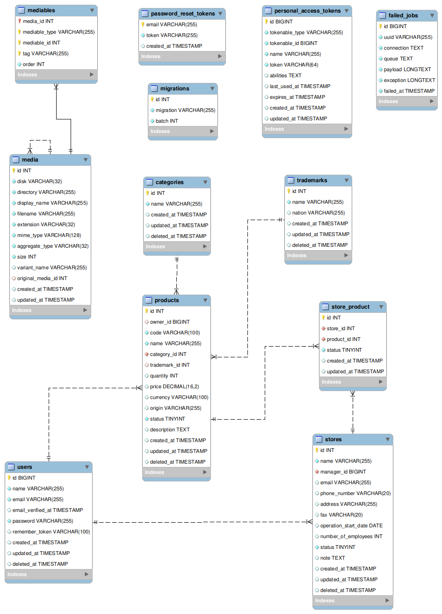

### Environments
- PHP: 8.2
- Laravel: 10x
- MySQl: 8.0

### Config .env
```sh
cp .env.example .env
```
```.env
APP_URL=app_url
APP_API_KEY=api_key     #Ex: 123456Aa
DB_HOST=
DB_PORT=
DB_DATABASE=
DB_USERNAME=
DB_PASSWORD=
SANCTUM_TOKEN_PREFIX=   #optional
```

### Commands
```sh
php artisan key:generate
php artisan storage:link
php artisan migrate --seed
#or
php artisan migrate:fresh --seed
```

### Api docs
- [Link preview docs](https://documenter.getpostman.com/view/12816675/2s9Y5eLdxc)
- Download source in folder `public/api-docs` and imports collection and environment to postman.
- Set environments:
    ```.env
    v1_domain=APP_URL
    x-api-key=APP_API_KEY
    ```

### ER Diagram

